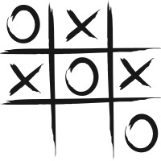

# TIC-TAC-TOE Game

## Description

**Tic-tac-toe** is a simple, two-player game where players take turns marking spaces in a 3x3 grid with either an 'X' or an 'O', aiming to place three of their marks in a horizontal, vertical, or diagonal row to win.

## Preview

## Tic-Tac-Toe: The Basics

Tic-Tac-Toe, also known as Noughts and Crosses, is a simple two-player game. Here's an overview of how it works:

1. **Game Board:** The game is played on a grid that's 3 squares by 3 squares.

2. **Players:** There are two players in the game. One plays as 'X', and the other as 'O'.

3. **Objective:** The goal is to be the first player to get 3 of your marks in a row (up, down, across, or diagonally).

4. **Game Play:**
    * Players take turns putting their marks in empty squares.
    * The first player is typically 'X', and the second is 'O'.

5. **Winning the Game:** The first player to align their three marks vertically, horizontally, or diagonally wins.

6. **Draw:** If all 9 squares are filled and no player has 3 marks in a row, the game is a draw.